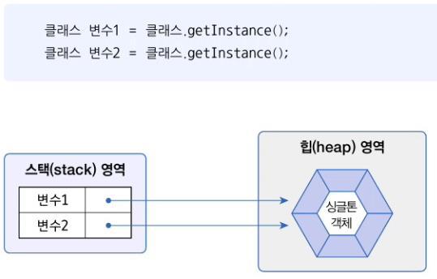
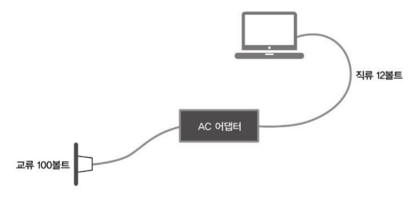
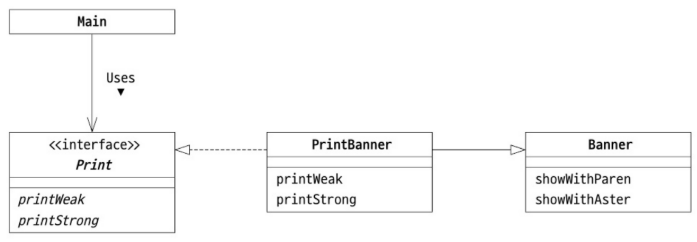
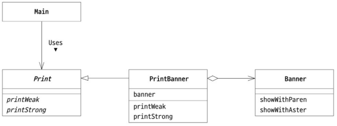
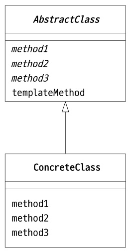
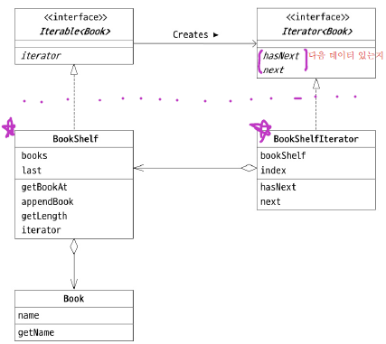
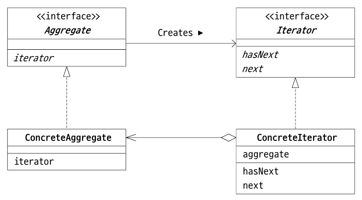
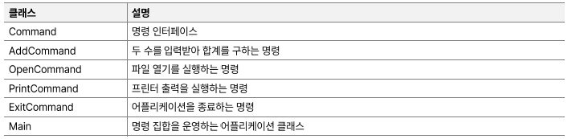
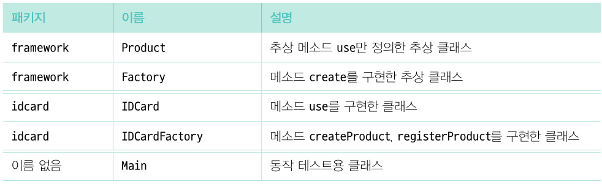
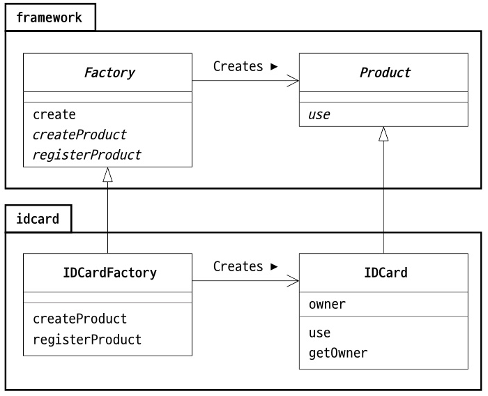

***Design Pattern***

🐹 Singleton

- **생성자를 private 접근 제한**해서 외부에서 new 연산자로 생성자를 호출하라 수 없도록 막아서 외부에서 객체를 생성하지 못하게 함
- 대신 싱글톤 패턴이 제공하는 **정적 메소드를 통해 간접적으로 객체를 얻을 수 있음**

---
🐹 Adapter
- 사이에 끼워 재사용한다
- 두 개의 형태가 다른 객체 
-> 중간 매개체(어댑터)로 우회해서 연결 

- **Wrapper 패턴**이라고 불리기도 함
  

- Adapter 패턴의 종류
  - 클래스에 의한 Adapter 패턴(상속을 사용한 패턴)  ***-->위임보다 간단 !***
    - **adapter.adapter1**
    
  - 인스턴스에 의한 Adapter 패턴(위임을 사용한 패턴) ***-->상속보다 유연 !***
    - **adapter.adapter2**
    

★★ 코드 재사용은 '위임'을 권장 

- 어떤 경우에 사용?
  - 프로그래밍할 때 늘 백지상태에서 시작하는 것은 아님
  - 이미 존재하는 클래스를 이용하는 경우
  - 기존 클래스에 한 겹 덧씌워 필요한 클래스를 만듦
 

-----
🐹 template method 패턴 

- 템플릿 : 문자 모양대로 난 얇은 플라스틱 판
  - 절차는 **부모 클래스**가 결정, 각 절차에서 할 일은 **자식 클래스**가 판단
    

    - 부모 클래스는 보통 추상 클래스(추상 템플릿)
    - 자식이 상속 받아 해당 추상 메소드를 구현

-> 기존 클래스를 전혀 수정하지 않고 목적한 인터페이스에 맞추는 것
  - 기존 클래스의 소스 프로그램이 반드시 필요한 것이 아님

  - 왜 사용하는가?
      - 로직을 공통화할 수 있다
          - 상위 클래스의 템플릿 메소드에 알고리즘이 기술되어 있음
          - 하위 클래스는 알고리즘을 일일이 기술할 필요 없음
       
            -> **framework의 기본 패턴**

      - 상위 클래스와 하위 클래스의 연계 플레이
      - 하위 클래스를 상위 클래스와 동일시 한다
   

---
🐹 Iterator 패턴

- **Iterator - 처리를 반복하다**
    - **인덱스 사용하지 않고 처리를 반복**
    - 변수 i의 기능을 추상화하여 일반화한 것

iterator의 클래스 다이어그램

---
🐹 Command 패턴

- **Command pattern - 명령을 클래스로 표현한다**
    - Command 클래스
        - **‘이 일을 처리 하시오’**라는 **‘명령’**을 표현하는 클래스
        - 처리하고 싶은 일을 `객체`로서 표현
    - 명령의 `집합`을 저장해 둠
        - 같은 명령 **재실행** 가능
        - 여러 명령을 모아서 새로운 명령으로 **재사용** 가능(재사용성 ▲)
    - 예제 프로그램
        - CLI 메뉴 기반의 간단한 어플리케이션
            - 사용자가 선택한 메뉴를 실행
              
              ** equalsIgnoreCase() : 대소문자 구분 X

    - Command 클래스 다이어그램
      

---
🐹 Factory Method 패턴
- **Factory Method - 하위 클래스에서 인스턴스를 만든다**
    - templateMethod를 응용 → 인스턴스 생성 장면에 적용
        - templateMethod: 부모(로직, 알고리즘)←자식(하는 일, 알고리즘의 세부 단계**→를 인스턴스 생성 장면에:factoryMethod**)
    - **예제 프로그램(factorymethod파일)**
        - 신분증 카드를 만드는 공장
        - 프레임워크 역할
            - Product 클래스와 Factory 클래스
        - 구체적인 내용 역할
            - IDCard 클래스와 IDCardFactory 클래스
         
              
         
      - 예제 프로그램 클래스 다이어그램
              
        **이탤릭체 : 추상메서드
