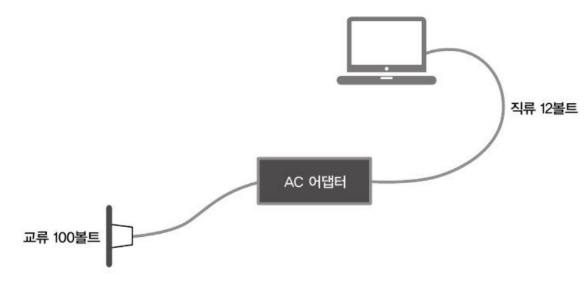

Design Pattern

🐹 Adapter
- 사이에 끼워 재사용한다
- 두 개의 형태가 다른 객체 
-> 중간 매개체(어댑터)로 우회해서 연결 

- **Wrapper 패턴**이라고 불리기도 함
- Adapter 패턴의 종류
  - 클래스에 의한 Adapter 패턴(상속을 사용한 패턴)
    - **adapter.adapter1**
  - 인스턴스에 의한 Adapter 패턴(위임을 사용한 패턴)
    - **adapter.adapter2**

